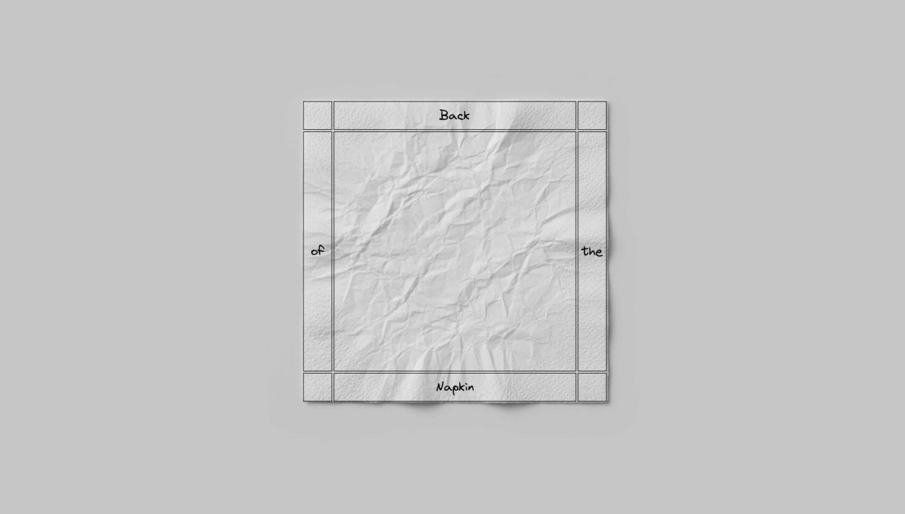

# Back of the Napkin

As my Web & Mobile professor, <a href="https://robertopia.com" target="_blank">Robert M. Kostin</a>, told us in class, "All the best designs are done on the back of napkins.". Now you too can create such designs without having to go through the trouble of obtaining a napkin to draw on!

## How to use
Just click on the napkin to get started! Hold shift and click on an element to add text to it.